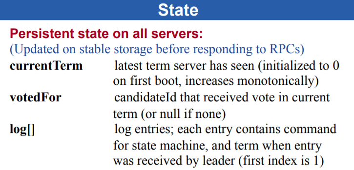
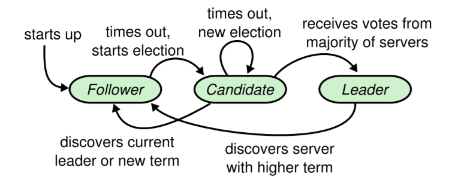
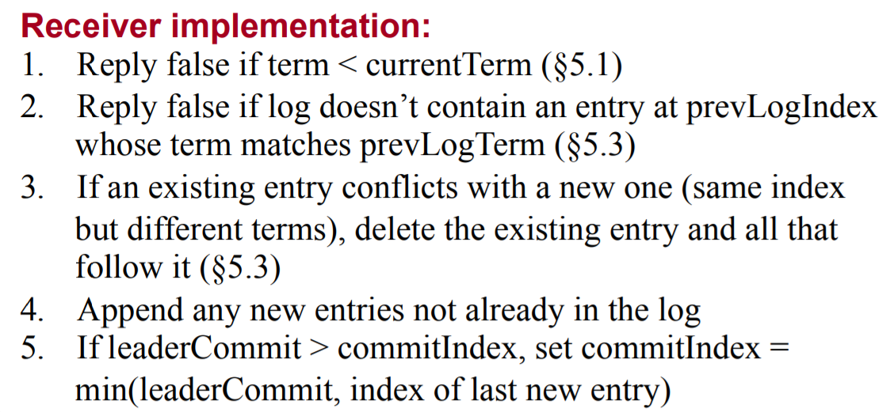
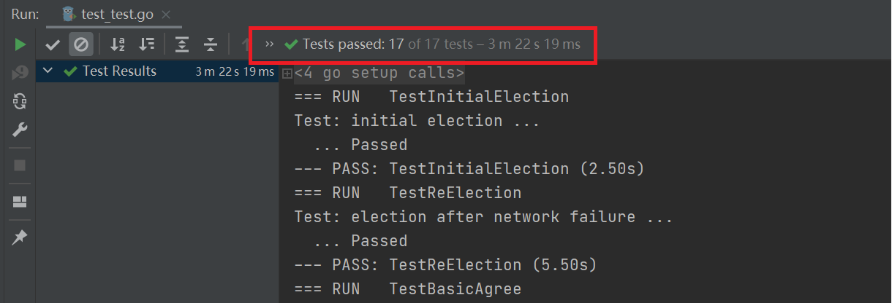
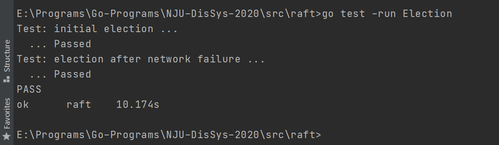
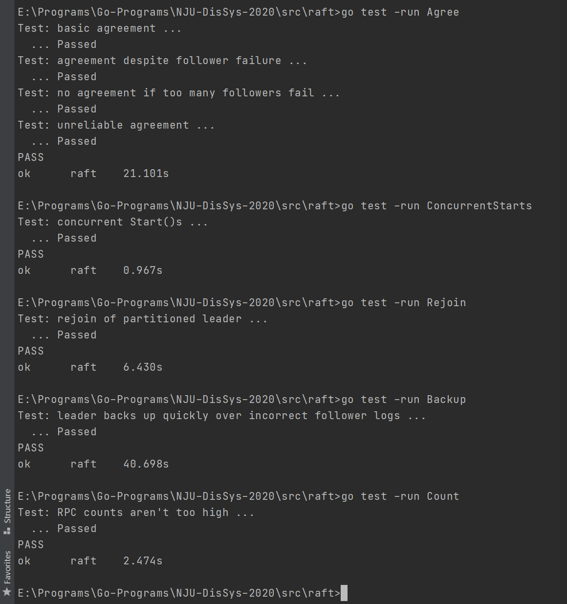
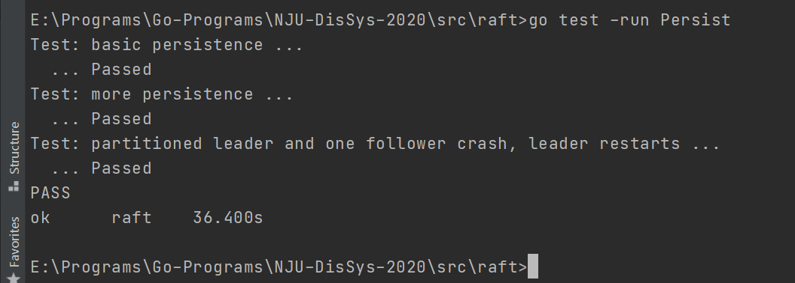
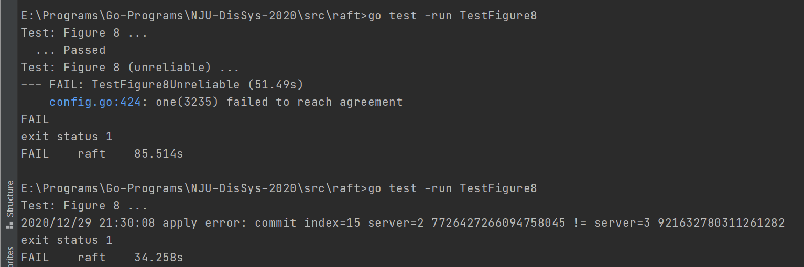
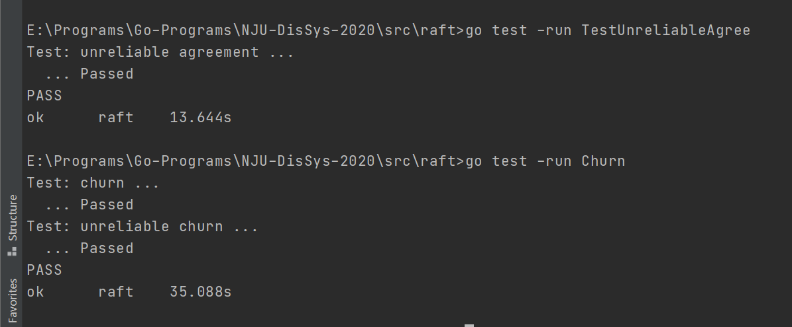

# 分布式系统课程实验报告

MF20330056 欧阳鸿荣


## 1. 综述

在本次实验中，我使用Go语言在给定框架上实现了简单的Raft协议，通过实现包括节点选举、心跳机制、日志追加和持久化等内容，完成了Part1，Part2和Part3。项目托管在github上，地址为[NJU-DisSys-2020](https://github.com/Tsunaou/NJU-DisSys-2020)。当实验DDL过了后我将开源。

## 2. 相关定义

根据Raft的[原始论文](https://www.usenix.org/system/files/conference/atc14/atc14-paper-ongaro.pdf)以及[扩展版论文](https://raft.github.io/raft.pdf)，我定义了如下常量和数据结构。

### 2.1 常量定义

#### 2.1.1 状态常量

首先是定义Raft中Sever的三种状态，分别是

- 领导者（Leader）
- 跟随者（Follower）
- 候选者（Candidate）

```go
// Raft中Server的三种状态
const (
	LEADER = iota
	FOLLOWER
	CANDIDATE
)
```

#### 2.1.2 时间常量

根据PPT，论文以及课程实验来源MIT6.824中lab2的要求，指定如下的时钟相关常量。

- 选举超时间隔 100-500ms
- 心跳间隔100ms

```go
// 时钟相关的
const (
	ElectionTimeoutMin = 100
	ElectionTimeoutMax = 500
	HeartBeatsInterval = 100
)
```

#### 2.1.3 日志常量

最后，额外定义一个特殊值`Backoff`用于日志的追加发生异常时的处理

```go
// AppendLog失败后是否需要回退一个Term
const (
	BackOff = -100
)
```

### 2.2 数据结构定义

#### 2.2.1 日志定义

首先，根据论文要求，定义如下的`LogEntry`表示在Raft中各个节点中的log entry

```go
type LogEntry struct {
	Command interface{} // 状态机的命令
	Term    int         // log entry的term
	Index   int         // log entry的index
}
```

为了方便使用，我们额外记录了一个Index域，而不是使用数组的下标来表示Index。但是在最后实际系统实现中，由于往log数组中加入了一个**空log**，使得log数组的下标与Index值相等应该是一个需要被满足的循环不变量。那么可以用这个性质来Debug。

#### 2.2.2 Raft结构体定义

根据实验需要，我定义了如下Raft的结构体。除了框架代码给出了的内容，Raft结构体中主要还有如下内容：

**所有服务器中的持久化状态**

这部分内容是在Part3中将被持久化的状态，即使节点Crash后，也应该从持久化的设置中恢复。

```go
// Persistent state on all servers
currentTerm int        // server已知的最新term，初始化为0，单调递增
votedFor    int        // 当前term中所投票的id，如果没有投票，则为null
log         []LogEntry // 实际日志的下标从1开始
```

**所有服务器中的不稳定状态**

```go
// Volatile state on all servers
commitIndex int // committed的最大的log entry index，初始化为0，单调递增
lastApplied int // 应用到状态机的最大的log entry index，初始化为0，单调递增
```

**Leader中的不稳定状态**

```go
nextIndex  []int // 对每个server下一个要发送的log entry的序号，初始化为 leader last log index+1 
matchIndex []int // To replicated，对每个server，已知的最高的已经复制成功的序号
```

**实验相关的辅助字段**

除了论文Figure2所给内容外，为了实现选举，心跳机制和日志追加等内容，我还给Raft结构体增加了如下字段。

其中，通过Go语言中的`time.Timer`提供的计时超时功能，实现选举以及心跳（日志追加）。

```go
// Self defined
role           int         // 服务器状态
leaderID       int         // Follower的Leader
electionTimer  *time.Timer // Leader Election的定时器
heartBeatTimer *time.Timer // Heart Beat的定时器
applyCh        chan ApplyMsg // 日志Apply的通道
```

#### 2.2.3 Request Vote 相关定义

这个主要根据论文内容来，没有什么特别。需要注意的一点就是首字母得大写，否则会报错。

```go
type RequestVoteArgs struct {
	Term         int // 候选人的term
	CandidatedId int // 候选人的ID
	LastLogIndex int // 候选人日志中最后一条的序号
	LastLogTerm  int // 候选人日志中最后一条的term
}

type RequestVoteReply struct {
	Term        int  // 当前的term，用于使候选人更新状态
	VoteGranted bool // 若为真，则表示候选人接受了投票
}
```

#### 2.2.4 Append Entries 相关定义

这个也主要根据论文内容来，但是为了实现的方便，在`AppendEntriesReply`中增加了一个`NextIndex`的字段，直接标识若向某节点日志追加失败后，该节点的`nextIndex`应该被置为何值。

```go
type AppendEntriesArgs struct {
	Term         int        // 领导者的term
	LeaderId     int        // 领导者的ID，
	PrevLogIndex int        // 在append新log entry前的log index
	PrevLogTerm  int        // 在append新log entry前的log index下的term
	Entries      []LogEntry // 要append log entries
	LeaderCommit int        // 领导者的commitIndex

}

type AppendEntriesReply struct {
	Term      int  //
	Success   bool // 成功，若Follower包含匹配prevLogIndex和prevLogTerm的entry
	NextIndex int  // 下一个要append的Index，根据AppendEntries的情况来判断
}
```

## 3. Raft协议实现设计

仔细分析需求，实际上各个Part对应的分别是Raft协议中的如下内容

- Part1: 节点选举与心跳机制
- Part2: 日志追加和命令应用
- Part3: 持久化

接下来我将根据Part3，Part1和Part2的顺序阐述我的设计思路

### 3.1 Part3 持久化

从简单的开始，先分析持久化。如2.2.2中所示，Raft中每个Server都有3个持久化状态

<div>
    
</div>

那么对于这3个持久化状态就需要满足：

- 当节点启动时，若有已持久化的值，需要进行持久化状态的恢复

  ```go
  rf.readPersist(persister.ReadRaftState())
  ```

- 当持久化状态的字段被修改时，需要进行数据的持久化

  ```go
  // currentTerm，votedFor或log被更改
  rf.persist()
  ```

以上便是有关Part3的内容。实际上当运行Persist相关测试时，若会出错，大概率是Part1和Part2出的问题。

### 3.2 Part1 领导选举和心跳机制

对于Raft协议的实现，由于我将心跳机制和日志追加合并为相同的实现，因此我将其归纳为3个循环，分别是

1. Leader Election Loop
2. Heartbeats Loop
3. Apply Loop

在代码中对应`Make`函数中的如下部分

```go
go rf.LeaderElectionLoop()
go rf.heartBeatLoop()
go rf.applyLoop()
```

Part1主要涉及前两个循环。下面对其分别进行阐述。

#### 3.2.1 领导选举 Leader Election Loop

Raft中节点的状态转换的生命周期可由下面这张图进行概括

<div>
    
</div>

在Leader Election Loop中，实际上我们就是要启动一个Go Routine不断维护这个生命周期。具体的实现如下：

**初始化**

当节点启动时，每个节点都将自己置为Follower状态，同时初始化选举时钟

```go
rf.role = FOLLOWER
rf.electionTimer = time.NewTimer(100 * time.Millisecond)
```

**选举超时，成为 Candidate**

接着，每个节点进入自己的Leader Election循环，不断监听`electionTimer`的超时信号。当收到超时信号时，重置选举计时器。当自己不是Leader时，就更新自己的状态为Candidate，并向各个节点广播Request Vote，准备进入Leader Election的过程。

```go
func (rf *Raft) LeaderElectionLoop() {
	for {
		// 等待 election timeout
		<-rf.electionTimer.C // 表达式会被Block直到超时
		rf.resetElectionTimer()

		rf.mu.Lock()
		if rf.role == LEADER {
			rf.mu.Unlock()
			continue
		}

		if rf.role == FOLLOWER || rf.role == CANDIDATE {
			rf.switchToCandidate()
			rf.mu.Unlock()
			rf.sendRequestVoteRPCToOthers()
		}
	}
}
```

在Raft中，节点状态的变更是很经常发生的事情，且每次的行为都几乎一致。为了方便和提高代码的复用率，我将其封装为如下3个函数，分别会进行状态切换时各个字段的更新。

```go
func (rf *Raft) switchToLeader() {}
func (rf *Raft) switchToCandidate() {}
func (rf *Raft) switchToFollower(term int) {}
```

**广播 Request Vote**

Candidate将向其他各个节点发送Request Vote广播，内容包括候选节点的Term，序号等信息，收到广播的节点将根据这些信息判断是否应该投票给该候选人。那么实际上这里就分为了Request Vote的接受者和发送者。

**发送者（Candidate）行为**

在我的实现中，Candidate将启动多个Go Routine来进行并发的广播，并通过如下定义的`voteCh`来统计投票结果

```go
voteCh = make(chan bool, n)
for{
    vote := <-voteCh
    // 统计投票
}
// 判断自己是否能成为Leader
```

统计过程中时刻检查是否自己已经成为了Follower，若是，则结束该计票过程，等待下次的选举。若依然是Candidate，则不断统计来自其他节点的投票，若收到了集群中majority数目的投票，则成为Leader。若统计到等价于自己不可能成为Leader的信息，则等待下一轮选举，或者其他节点成为Leader：此时该节点会因为心跳机制成为Follower。

当Candidate成为Leader后，将会重置自己的`resetElectionTimer`，新建自己的可变变量，并设置自己的`heartBeatTimer`，立刻启动心跳机制，从而告知其他节点停止选举，安心成为Follower。

```go
func (rf *Raft) switchToLeader() {
	rf.role = LEADER
	rf.leaderID = rf.me
	rf.resetElectionTimer()
	rf.heartBeatTimer.Reset(0) // 马上启动心跳机制
	// ...
}
```

**接受者行为**

对于一个接收到Request Vote请求的节点而言，它可以选择投票，也可以选择拒绝投票。

根据Raft的设计原理，有如下约束：

- 在同一Term内每个节点只能投一次票
- 节点会拒绝掉Term小于自己或是日志没有达到"up-to-date"的Candidate的请求。

这体现在如下函数中

```go
func (rf *Raft) rejectVote(args RequestVoteArgs) bool {
	if rf.role == LEADER {
		return true
	}
	if rf.votedFor != -1 && rf.votedFor != args.CandidatedId {
		return true
	}
	// $5.4.1的限制
	lastLogIndex, lastLogTerm := rf.getLastLogIndexTerm()
	if lastLogTerm != args.LastLogTerm {
		return lastLogTerm > args.LastLogTerm
	}
	return lastLogIndex > args.LastLogIndex
}
```

同时，当接收到Term大于自己的投票请求后，无论是否投票，都可判断自己只能做一个Follower，并转变状态，更新自己的Term。则有接受者的行为可以描述为如下步骤：

```go
func (rf *Raft) RequestVote(args RequestVoteArgs, reply *RequestVoteReply) {
	// ...
	// 初始化 reply
	reply.VoteGranted = false
	reply.Term = rf.currentTerm

	if rf.currentTerm > args.Term {
		return
	} else if rf.currentTerm < args.Term {
		rf.switchToFollower(args.Term)
	}

	// 是否可以进行投票
	if rf.rejectVote(args) {
		return
	}
	// 可以投票 ...
}
```

#### 3.2.2 心跳机制 Heart Beats Loop

在我的实现中，心跳机制和日志追加实际上是使用同一套系统，只是日志追加的内容是空的而已。当一个节点成为Leader后，会立刻触发一次心跳。该循环如下所示，实际上可以看出，在我的实现中，每个节点都有心跳循环，只是只有Leader的心跳才会真正被发送出去。同样的，这里的心跳发送也是并行发送。

同时注意到这里，最好在每次发送前就将Leader的`nextIndex`和`matchIndex`更新到最新值。

```go
func (rf *Raft) heartBeatLoop() {
	for {
		<-rf.heartBeatTimer.C
		rf.resetHeartBeatTimer()
		rf.mu.Lock()
		if rf.role != LEADER {
			rf.mu.Unlock()
			continue
		}
		rf.mu.Unlock()
		for slave := range rf.peers {
			// 不发送给自己
			if slave == rf.me {
				rf.nextIndex[slave] = len(rf.log) + 1
				rf.matchIndex[slave] = len(rf.log)
				continue
			} else {
				go rf.sendAppendEntriesRPCToPeer(slave)
			}
		}
	}
}
```

在Part1中是不存在日志的追加的，那么这里的心跳包内容也非常简单，包括

- Term：Leader的`currentTerm`
- LeaderID

当节点收到心跳时，会比较节点的`currentTerm`与心跳包的`Term`，若节点的`currentTerm`不大于心跳包的`Term`，则收到心跳包的节点会成为Follower，从而保障能选出一个Leader。这里需要注意的是每次收到有效的心跳包后都要随机重置选举的定时器。

```go
func (rf *Raft) AppendEntries(args AppendEntriesArgs, reply *AppendEntriesReply) {
	// ... 
	// 初始化
	reply.Success = false
	reply.Term = rf.currentTerm

	// 拒绝Term小于自己的节点的Append请求
	if rf.currentTerm > args.Term {
		return
	}

	rf.currentTerm = args.Term
	rf.switchToFollower(args.Term)
	rf.resetElectionTimer() // 收到了有效的Leader的消息，重置选举的定时器

	// append, commit, or else
}
```

### 3.3 Part2 日志追加与命令应用

在Part中，主要就是补充Part1中的日志追加部分，并且当日志在大多数据节点中提交后，将会进行命令的应用。这里我们介绍第三个，也是最后一个循环

#### 3.3.1 Apply Loop

Apply Loop也是每个节点都会启动的一个后台不断循环的Go Routine。该循环不断检测是否有新的commitIndex，若有，则立刻应用已commit但是尚未apply的log命令，直到`lastApplied == commitIndex`

```go
func (rf *Raft) applyLoop() {
	for {
		time.Sleep(10 * time.Millisecond)
		rf.mu.Lock()
		for rf.lastApplied < rf.commitIndex {
			rf.lastApplied++
			rf.apply(rf.lastApplied)
		}
		rf.mu.Unlock()
	}
}
```

日志的Apply与`Make`中的`ApplyCh`相关，这一点一开始实验并不懂，导致除了很多问题。

#### 3.3.2 Append Entries

当Leader向节点X发送心跳包时，实际上是根据Leader记录的节点X的`nextIndex`（也即对X下一个要发送的log entry的序号），选择Leader上log的一部分附加在心跳包中进行发送，随着心跳包发送的还有`Term, PrevLogIndex, PrevLogIndex, LeaderCommit`等，详见2.2.4。同样的日志的追加也可以分为Append Entries的接受者和发送者。

**接受者**

对于接受者的行为，主要根据论文中这5点分别进行实现，并针对不同情况进行细化，从而简化日志追加的重试。

<div>
    
</div>

1. 正如3.2.2中提到的，接受者会拒绝心跳包中`Term`小于接受者`currentTerm`的追加日志请求
2. 若接受者节点的`lastLogIndex`小于心跳包中的`PrevLogIndex`，这说明接受者的log是陈旧于Leader的，因此通过`reply.NextIndex`直接告知Leader下次应该从哪个Index的log开始发送
3. 若接受者节点日志中上一次添加的`Term`与心跳包中信息不吻合，则通过`reply.NextIndex`通知Leader下次发送时应该直接从前一个Term的内容发送
4. 否则，无论在应该添加的位置处是否有日志，都在Follower上直接覆盖追加来自Leader的日志。

```go
lastLogIndex, _ := rf.getLastLogIndexTerm()
if args.PrevLogIndex > lastLogIndex {
    reply.NextIndex = rf.getNextIndex()
} else if rf.log[args.PrevLogIndex].Term != args.PrevLogTerm {
    reply.NextIndex = BackOff
} else {
    reply.Success = true
    rf.log = append(rf.log[0:args.PrevLogIndex+1], args.Entries...) 
}
```

5. 同时，接受者会接受来自Leader的`leaderCommit`信息，通过上图所定义规则更新接受者的`commitIndex`

**发送者**

发送者发送心跳后，将会受到心跳的回复，并根据回复进行应答，作出不同的响应。

首先，如果`reply.Term > currentTerm`，则此时原来的Leader已经成为了Follower，需要进行状态的改变。那么此时若发送者已经不是Leader，则无需进行后续对结果的响应。

若发送者此时仍是Leader，则会响应`reply`的值

- 若reply成功：则将更新对应（发送`reply`）节点的`matchIndex, nextIndex`等信息，并根据各个节点的`matchIndex`尝试更新`commitIndex`。此时Apply Loop仍在监听`commitIndex`的更新并不断尝试追加。

- 若reply失败：则根据`reply.Index`更新对应（发送`reply`）节点的`nextIndex`等信息，可能要后退一个Term进行尝试。

  ```go
  if reply.Success {
      lenEntry := len(args.Entries)
      rf.matchIndex[slave] = args.PrevLogIndex + lenEntry
      rf.nextIndex[slave] = rf.matchIndex[slave] + 1
      majorityIndex := getMajoritySameIndex(rf.matchIndex)
      if rf.log[majorityIndex].Term == rf.currentTerm 
      && majorityIndex > rf.commitIndex {
          rf.commitIndex = majorityIndex
      }
  } else {
      if reply.NextIndex > 0 {
          rf.nextIndex[slave] = reply.NextIndex
      } else if reply.NextIndex == BackOff {
          // 直接后退一个term
          prevIndex := args.PrevLogIndex
          for prevIndex > 0 && rf.log[prevIndex].Term == args.PrevLogTerm {
              prevIndex--
          }
          rf.nextIndex[slave] = prevIndex + 1
      }
  }
  ```

## 4. 实验演示

在`test_test.go`中，根据是否测试Raft扩展论文中的Figure8描述的内容，样例分为2部分。

在最理想的情况下，我能通过全部的17个测试样例。

<div>
    
</div>

但是对于TestFigure8和TestFigure8Unreliable这两个样例，我有一定概率通不过，应该是实现仍存在问题。

但是对于第二部分的TestUnreliableAgree，TestReliableChurn和TestUnreliableChurn，仍然可以正常通过。

### 4.1 Part 1

能够成功通过Part 1中关于领导选举的2个样例

- TestInitialElection
- TestReElection

<div>
    
</div>

### 4.2 Part 2

能够通过Part 2中关于日志追加和应用的7个样例

- TestBasicAgree
- TestFailAgree
- TestFailNoAgree
- TestConcurrentStarts
- TestRejoin
- TestBackup
- TestCount

<div>
    
</div>

### 4.3 Part 3

能够通过Part 3中关于持久化的3个样例
- TestPersist1
- TestPersist2
- TestPersist3

<div>
    
</div>
### 4.4 Extra Part

对于TestFigure8和TestFigure8Unreliable这两个样例，有一定概率通过，也有一定概率通不过。

<div>
    
</div>

但其他样例，仍然可以正常通过。

<div>
    
</div>


## 5. 实验总结

本次的Raft实验真的是很考验人，最终代码的实验也并不能达到完美，但是能够亲手实现一个经典且著名的分布式算法，并且学习了最近很火的Go语言，属实让我受益匪浅。以下让我来谈谈我的一些感想。

自从1990年Lamport提出了Paxos算法后，Paxos算法几乎成了共识算法的代名词，无论是学校的教育，还是工业界分布式系统的设计都围绕着Paxos在进行。尽管Paxos正确性和效率已经被证明了，但是Paxos本身也存在着一些致命的问题，包括：

- 可理解性太差。 

- 可实现基础薄弱。 

- 架构不利于现实系统的构建。 

即便是对分布式算法和分布式系统有着很敏锐直觉的经验丰富的研究员，在面对Paxos算法时也感到十分棘手，对于学生而更是要付出巨大的努力才能在Paxos的世界中初窥门径。同时，Lamport的 工作主要针对的是single-decree Paxos，然而对于multi-Paxos只是做了一个梗概而略过了很多实现的细节，这导致迄今为止都没有一个被广泛认可的multi-Paxos算法(也许这也是没有取得一种共识的表现)， 现实世界中基于Paxos的系统也都在原始的理论上做了优化或者新的假设。以上问题导致Paxos在算法的描述和现实世界的鞄求中有三道巨大的鸿沟，尽管Paxos在理论上被证明是正确的，但是现实系统的实现并无法拟合理论，这便导致了一系列证明失去了意义。这也促使着这篇论文的核心成果-Raft的诞生。 

在本身对Paxos算法有一定了解的基础上，在读了raft的论文后，的确是感觉到了Raft相对于Paxos的简单，但是这并不意味着Raft的实现就是简单的。实际上，哪怕是最简单的异步并发算法都很难写正确，何况是Raft这样的系统。以下便是我在实验中遇到的一些坑

### 锁的使用

在实验中，对于`rf`共享的变量访问往往需要加锁来保证互斥。这时候就涉及到加锁的粒度，可以函数级别加锁，也可以细粒度加锁。显然，细粒度加锁较为繁琐，但是可以获得更好地并发度。在实验中一开始我是选择函数级别加锁的，这导致很多样例都通不过。

### 超时的选择

在我的实现中，主要有2个时钟，一个是选举的时钟，一个是心跳的时钟。这两个时钟的超时选取都是一门很大的学问，很可以设置不好就会导致一些奇怪的bug。包括一开始我以为的程序是对的（当我使用我教研室的主机运行时），但是当我使用笔记本时，又会出现新的问题，这一方面和测试样例对于时间的要求有关，另一方面也跟每台机器运行的速度有关。正是因为分布式系统中的时钟无法完全同步，且各个机器性能不同，才需要有分布式共识算法等。当然这也给我的实现带来了很多问题。

### 并发程序的Debug

不得不说并发程度的Debug真的很难，一方面是问题难以准确复现，需要打印出很多log才能推测当时的运行时环境。另一方面便是当并发数增加时，日志的查看会变得很困难，最终只能选择把几乎所有内容都打印出来，一行行看来Debug。当然，在这个实验中，可以通过学习`labrpc, config`的内容来推敲出每个测试样例究竟是测试怎样的场景，然后考虑自己的程序在类似场景下会有什么问题，这样的方法显然会更有效率一些。

